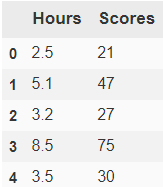
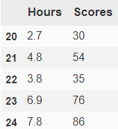
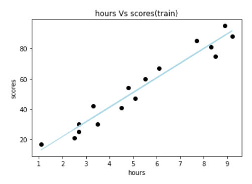
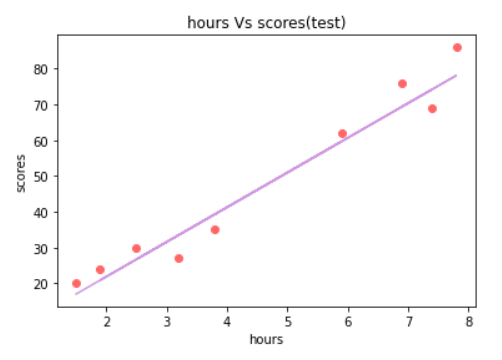

# Implementation-of-Simple-Linear-Regression-Model-for-Predicting-the-Marks-Scored

## AIM:
To write a program to implement the simple linear regression model for predicting the marks scored.

## Equipments Required:
1. Hardware – PCs
2. Anaconda – Python 3.7 Installation / Moodle-Code Runner

## Algorithm
1. Import the standard libraries in python for finding linear regression.
2. Assign a variable 'dataset' for reading the content in given csv file.
3. Split the supervised data and unsupervised data in the dataset using train_test_split method.
4. Using training and test values on dataset, predict the linear line.
5. Assign the points for representing in the graph.
6. Predict the regression for marks by using the rep resentation of the graph.
7. Compare the graphs and hence we obtained the linear regression for the given datas.

## Program:
```
/*
Program to implement the simple linear regression model for predicting the marks scored.
Developed by: SRIJITH R
RegisterNumber: 212221240054 
*/
import pandas as pd
import numpy as np
import matplotlib.pyplot as plt

from sklearn.linear_model import LinearRegression
df=pd.read_csv('student_scores - student_scores.csv')
df.head()
df.tail()

x=df.iloc[:,:-1].values
y=df.iloc[:,1].values

from sklearn.model_selection import train_test_split
x_train,x_test,y_train,y_test = train_test_split(x,y,test_size = 1/3,random_state=0)
regressor = LinearRegression()
regressor.fit(x_train,y_train)
y_pred=regressor.predict(x_test)

#for training data
plt.scatter(x_train,y_train,color = "black")
plt.plot(x_train,regressor.predict(x_train),color= "lightblue")
plt.title("hours Vs scores(train)")
plt.xlabel("hours")
plt.ylabel("scores")
plt.show()

#for test data
plt.scatter(x_test,y_test,color='#FF6766')
##FF6766 is light red Color
plt.plot(x_test,regressor.predict(x_test),color='#D099E2')
##D099E2 is Lavendar Color
plt.title("hours Vs scores(test)")
plt.xlabel("hours")
plt.ylabel("scores")
plt.show()
```

## Output:
### Contents in the data file (head, tail):


### Linear Regression Graph(For Training Data):

### Linear Regression Graph(For Test Data):


## Result:
Thus the program to implement the simple linear regression model for predicting the marks scored is written and verified using python programming.
